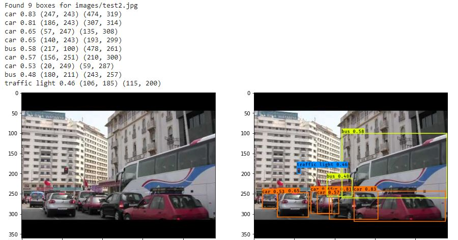

# YOLOv3 on keras

Model build based on the original pre-trained YOLO model. Assets are stored on a public drive.

## Usage

Upload the notebook to Colab and run all (notebook should work directly with no changes)

Optional: tune threshlods (confidence, IoU,...) as you like, change images or test on your own images.

## Results preview

## References:

Pre-trained weights from <a href="https://pjreddie.com/darknet/yolo/"> YOLO website </a>

Conversion of the model from C and Darknet to Keras using  <a  href="https://github.com/qqwweee/keras-yolo3">github.com/qqwweee/keras-yolo3</a>

Original Paper <a  href="https://arxiv.org/abs/1804.02767">YOLOv3: An Incremental Improvement by Joseph Redmon, Ali Farhadi</a>
